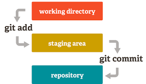
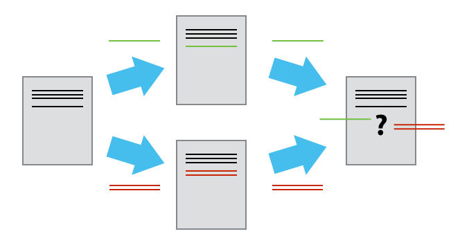
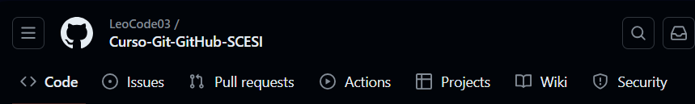
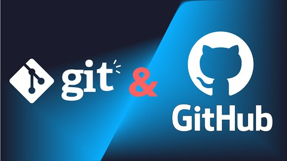

# APUNTES CURSO GIT/GITHUB SCESI 

---
# Clase 1:
## Que es un Controlador de Versiones?
Es un sistema que regitra cada cambio que se hace al codigo fuente de un proyecto en un repositorio.
Esto permite un historial detallado:
* **Que se hizo**
* **Quien lo hizo**
* **Cuando lo hizo**

> VENTAJAS
> * **Cada cambio realizado no implica una copia de todo el proyecto**
> * **Rendimiento:** Solo se guarda lo necesario
> * **Seguridad:** Conserva toda accion
> * **Flexibilidad:** No es necesario un desarrollo **lineal**
## Ques es Git?
Es un controlador de versiones que permite trabajar localmente en un proyecto que esta distribuido entre varias personas que desarrollan un proyecto de software de manera remota.
> *"Cada quien trabaja en una parte del proyecto localmente y los cambios importantes se suben a un repositorio remoto donde se encuentra el proyecto"*
> 
**Un repositorio es un carpeta donde se almacena un proyecto con sus respectivos cambios y su historico. Estos repositorios pueden ser Locales o Remotos**
# INICIAR UN PROYECTO CON GIT
Para iniciar un proyecto con git se debe seleccionar una carpeta que se convertira en el repositorio. Todos archivos que contenga esta carpeta seran los elementos que componen al proyecto. Existen dos maneras para iniciar nuestro proyecto con Git:
1. `$ git init <nombreArchivoProyecto>`
   
   `$ cd <nombreArchivoProyecto>`

2. `$ cd <nombreArchivoProyecto>`
   
   `$ git init` 

>*Se crea una carpeta que tendra el identificador `(MAIN)`, esto indica que el archivo es el repositorio principal de nuestro proyecto.*

   

## COMMITS Y SUS ESTADOS
Un commit es una modificacion o agregacion que se hace a un proyecto.

> *Como se menciono anteriormente, no se debe hacer una copia de todo el proyecto para añadir una modificacion. Lo que hace git es identificar solo la parte modificada y añadirlo al proyecto principal, mediante un commit*

Para saber el estado de un archivo se utiliza el siguiente comando:
`$git status`
### MODIFIED: 
Un archivo ha sido creado, eliminado o modificado dentro el repositorio. `Git` identifica esto y lo marca en color rojo como:
* `Modified` si existe una modificacion
* `Untracked` si un archivo se crea o añade
### STAGED:
Utilizando el comando `$git add <archivo.ext>` el archivo pasa a un estado de `Stage`. Este estado indica que el archivo se encuentra **PREPARADO** para realizar un commit y guardar los cambios en el repositorio principal del proyecto. 
`$ git add .` para añadir todos los archivos de la carpeta a `Stage`*(esto puede ser una mala practica a veces, pues habra circunstancias donde NO todas las modificaciones seran añadidas)* 

`$ git restore --staged <archivo>` saca al archivo del area de stage.

`$ git restore --staged .` saca todos los archivos del area de stage.
### COMMITED:
El comando `$ git commit` guarda finalemente el archivo en el repositorio principal del proyecto (local o remoto), *`"Es como guardar un checkpoint en un juego"`*. Al ejecutar un commit, se debe añadir una descripcion clara sobre que se hizo en el commit con respecto al proyecto. Para esto, git abre una ventana emergente donde se pide añadir esa descripcion. Otra forma de realizar esto es `$ git commit -m "descripcion del Commit"`

`$git commit --amend - m "descripcion"` permite reescribir el ultimo commit

`$ git log` muestra el historial de los commits, donde en primer lugar se encuentra el ultimo commit(HEAD) realizado y en ultimo lugar se encuentra el primer commit ejecutado del proyecto o rama.
> `(HEAD)` indica la posicion o commit actual en la que estamos. 
> Podemos movernos entre commits.
---
# Clase 2:
## Que es una Rama?
Es la bifurcacion de un commit donde se tiene una linea de trabajo distinta a la rama Main, que posteriormente se volvera a unir (o no) con esta. Las ramas sirven para realizar un desarrollo paralelo, no lineal y colaborativo.
Antes de crear una rama, necesitamos esta posicionados en un commit.

* `$ git branch <nombreRama>`: creamos una nueva rama
* `$ git checkout -b <nombreRama>`: creamos una nueva rama y nos posicionamos sobre ella
  - `$ git branch`: devuelve una lista de todas las ramas que tenemos

* `$git checkout <nombreRama o hashCommit>`:Permite cambiar de rama incluso si tienes cambios sin confirmar

* `$git switch <nomreRama o hashCommit>`:No permite cambiar de rama si tienes cambios sin confirmar

>Al crear una rama a partir de un commit, el ID o hash del primer commit de la rama creada, es una copia del commit del que se obtuvo dicha rama

## Fusion de Ramas (MERGE)
las ramas pueden terminar en el olvido o fusionarse, integrando los cambios realizados con otra rama.

`$ git merge <nombreRama>`: Fusiona la rama que indicamos con la rama en la que estamos posicionados, realizando un commit.

`$ git merge --edit <nombreRama>`: Permite añadir una descripicion como en los commits

`$ git merge --no-commit <nombreRama>`: Evita que se haga el commit automatico del merge

## Elimnar Ramas
Se eliminan ramas como una buena practica para mantener limpio el espacio de trabajo, pues, una rama debe tener un unico proposito y corto de tiempo.

`$ git branch -d <nombreRama>`: Elmina la rama

`$ git branch --delete <nombreRama>`: Elimina una rama

>Git detecta cuando queremos eliminar una rama, por lo tanto nos da una advertensia si esa rama no fue fusionada con el main.
Este mensaje no aparece con las ramas que fueron fusionadas con la rama **main**

`$ git branch -D <nombreRama>`:Elimina de manera forzada la rama 

#### UNA RAMA ELIMINADA NO PUEDE SER RECUPERADA
>*"Un truco para recuperar una rama seria mediante el historial de commits desde github"*
## Historial
Existen diferentes comando para acceder al historial de los commits realizados en todo el proyecto o sobre solo una rama.

* `git log <nombreRama>`:Ver el historial de commits de una rama especifica
* `git log`:Ver el historial de commits de todas las ramas
* `git log --graph`:Ver el historial de commits con graficos 
* `git log --oneline`:Ver el historial de commits de manera simplificada
* `git log --graph --online`:Ver el historial de commits de manera simplificada con graficos

 ## CONFLICTOS EN GIT
 Tenemos conflictos cuando queremos unir dos ramas que tienen modificaciones diferentes en las mismas lineas de codigo. Por lo tanto, GIT no es capaz de detenrmiar que camvio es el que tiene que prevalecer, por lo tanto es el usuario quien debe escoger el cambio que se queda.
 

 ----
# Clase 3: 
## Navegando por GitHub
* GitHub es una web que almacena repositorios remotos.
* En GitHub no solo podemos encontrar repositorios, tambien podemos encontrar personas, proyectos y organizaciones
* En un repositorio de git podemos encontrar diferentes apartados como:
  * `Code:` Donde se visualizan los archivos que componen al repositorio, codigo fuente y sus historial de commits
  * `Pull Request:`Es como un hilo de Twitter donde se ve la interaccion de personas que presentan commits que quieren subir al main pero necesitan autorizacion
  * `Actions:`Permite automatizar tareas de desarrollo, pruebas y despliegue
  * `Issues:`Aqui se observa el seguimiento de problemas, errores y tareas pendientes
  * `Proyects:`Organiza y gestiona el trabajo del proyecto en tableros
  * `Wiki:` En esta seccion se documenta el proyecto 
  * `Security:`Esta seccion proporciona herramientas para proteger el proyecto

## Enlazar un repositorio Local con uno Remoto
Primeramente necesitamos tener ciertas configuraciones en nuestro git Local para poder sincronizarnos
* `$ git config --global user.name "tuNombre"`
* `$ git config --global user.email "tuCorreoElectronico"`
>*Estas configuraciones globales de git mantienen un seguimiento de quien hizo un commit.*

* `$ git push origin main`:Envia los commits del repositorio local al repositorio remoto de GitHub
* `$ git push -f origin main`:Fuerza el envio del push
* `$ git clone <URLrepositorio>`: Un repositoirio cuenta con 2 tipos de url, HTTPS y SSH, este ultimo necesita un token para realizar la sincronizacion del repositorio como una forma de seguridad.
* `$ git push origin <nombreRama>`: Se crea una rama local que se sincroniza con el repositorio remoto.
* `$ git push --all`: Sube todas nuestras ramas al repositorio remoto
*  
