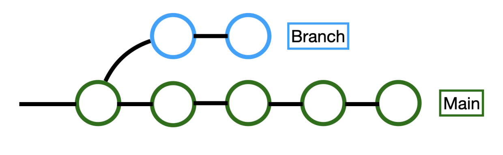

# APUNTES CURSO GIT/GITHUB SCESI 

---
# Clase 1:
## Que es un Controlador de Versiones?
Es un sistema que regitra cada cambio que se hace al codigo fuente de un proyecto en un repositorio.
Esto permite un historial detallado:
* **Que se hizo**
* **Quien lo hizo**
* **Cuando lo hizo**

> VENTAJAS
> * **Cada cambio realizado no implica una copia de todo el proyecto**
> * **Rendimiento:** Solo se guarda lo necesario
> * **Seguridad:** Conserva toda accion
> * **Flexibilidad:** No es necesario un desarrollo **lineal**
## Ques es Git?
Es un controlador de versiones que permite trabajar localmente en un proyecto que esta distribuido entre varias personas que desarrollan un proyecto de software de manera remota.
> *"Cada quien trabaja en una parte del proyecto localmente y los cambios importantes se suben a un repositorio remoto donde se encuentra el proyecto"*
> 
>

**Un repositorio es un carpeta donde se almacena un proyecto con sus respectivos cambios y su historico. Estos repositorios pueden ser Locales o Remotos**
# INICIAR UN PROYECTO CON GIT
Para iniciar un proyecto con git se debe seleccionar una carpeta que se convertira en el repositorio. Todos archivos que contenga esta carpeta seran los elementos que componen al proyecto. Existen dos maneras para iniciar nuestro proyecto con Git:
1. `$ git init <nombreArchivoProyecto>`
   
   `$ cd <nombreArchivoProyecto>`

2. `$ cd <nombreArchivoProyecto>`
   
   `$ git init` 

>*Se crea una carpeta que tendra el identificador `(MAIN)`, esto indica que el archivo es el repositorio principal de nuestro proyecto.*

   

## COMMITS Y SUS ESTADOS
Un commit es una modificacion o agregacion que se hace a un proyecto.

> *Como se menciono anteriormente, no se debe hacer una copia de todo el proyecto para añadir una modificacion. Lo que hace git es identificar solo la parte modificada y añadirlo al proyecto principal, mediante un commit*

Para saber el estado de un archivo se utiliza el siguiente comando:
`$git status`
### MODIFIED: 
Un archivo ha sido creado, eliminado o modificado dentro el repositorio. `Git` identifica esto y lo marca en color rojo como:
* `Modified` si existe una modificacion
* `Untracked` si un archivo se crea o añade
### STAGED:
Utilizando el comando `$git add <archivo.ext>` el archivo pasa a un estado de `Stage`. Este estado indica que el archivo se encuentra **PREPARADO** para realizar un commit y guardar los cambios en el repositorio principal del proyecto. 
`$ git add .` para añadir todos los archivos de la carpeta a `Stage`*(esto puede ser una mala practica a veces, pues habra circunstancias donde NO todas las modificaciones seran añadidas)* 

`$ git restore --staged <archivo>` saca al archivo del area de stage.

`$ git restore --staged .` saca todos los archivos del area de stage.
### COMMITED:
El comando `$ git commit` guarda finalemente el archivo en el repositorio principal del proyecto (local o remoto), *`"Es como guardar un checkpoint en un juego"`*. Al ejecutar un commit, se debe añadir una descripcion clara sobre que se hizo en el commit con respecto al proyecto. Para esto, git abre una ventana emergente donde se pide añadir esa descripcion. Otra forma de realizar esto es `$ git commit -m "descripcion del Commit"`

`$git commit --amend - m "descripcion"` permite reescribir el ultimo commit

`$ git log` muestra el historial de los commits, donde en primer lugar se encuentra el ultimo commit(HEAD) realizado y en ultimo lugar se encuentra el primer commit ejecutado del proyecto o rama.
> `(HEAD)` indica la posicion o commit actual en la que estamos. 
> Podemos movernos entre commits.
---
# Clase 2:
## Que es una Rama?
Es la bifurcacion de un commit donde se tiene una linea de trabajo distinta a la rama Main, que posteriormente se volvera a unir (o no) con esta. Las ramas sirven para realizar un desarrollo paralelo, no lineal y colaborativo.
Antes de crear una rama, necesitamos esta posicionados en un commit.

* `$ git branch <nombreRama>`: creamos una nueva rama
* `$ git checkout -b <nombreRama>`: creamos una nueva rama y nos posicionamos sobre ella
  - `$ git branch`: devuelve una lista de todas las ramas que tenemos

* `$git checkout <nombreRama o hashCommit>`:Permite cambiar de rama incluso si tienes cambios sin confirmar

* `$git switch <nomreRama o hashCommit>`:No permite cambiar de rama si tienes cambios sin confirmar

>Al crear una rama a partir de un commit, el ID o hash del primer commit de la rama creada, es una copia del commit del que se obtuvo dicha rama

## Fusion de Ramas (MERGE)
las ramas pueden terminar en el olvido o fusionarse, integrando los cambios realizados con otra rama.

`$ git merge <nombreRama>`: Fusiona la rama que indicamos con la rama en la que estamos posicionados, realizando un commit.

`$ git merge --edit <nombreRama>`: Permite añadir una descripicion como en los commits

`$ git merge --no-commit <nombreRama>`: Evita que se haga el commit automatico del merge

## Elimnar Ramas
Se eliminan ramas como una buena practica para mantener limpio el espacio de trabajo, pues, una rama debe tener un unico proposito y corto de tiempo.

`$ git branch -d <nombreRama>`: Elmina la rama

`$ git branch --delete <nombreRama>`: Elimina una rama

>Git detecta cuando queremos eliminar una rama, por lo tanto nos da una advertensia si esa rama no fue fusionada con el main.
Este mensaje no aparece con las ramas que fueron fusionadas con la rama **main**

`$ git branch -D <nombreRama>`:Elimina de manera forzada la rama 

#### UNA RAMA ELIMINADA NO PUEDE SER RECUPERADA
>*"Un truco para recuperar una rama seria mediante el historial de commits desde github"*
## Historial
Existen diferentes comando para acceder al historial de los commits realizados en todo el proyecto o sobre solo una rama.

* `git log <nombreRama>`:Ver el historial de commits de una rama especifica
* `git log`:Ver el historial de commits de todas las ramas
* `git log --graph`:Ver el historial de commits con graficos 
* `git log --oneline`:Ver el historial de commits de manera simplificada
* `git log --graph --online`:Ver el historial de commits de manera simplificada con graficos

 ## CONFLICTOS EN GIT
 Tenemos conflictos cuando queremos unir dos ramas que tienen modificaciones diferentes en las mismas lineas de codigo. Por lo tanto, GIT no es capaz de detenrmiar que camvio es el que tiene que prevalecer, por lo tanto es el usuario quien debe escoger el cambio que se queda.

 

 ----
# Clase 3: 
## Navegando por GitHub
* GitHub es una web que almacena repositorios remotos.
* En GitHub no solo podemos encontrar repositorios, tambien podemos encontrar personas, proyectos y organizaciones
* En un repositorio de git podemos encontrar diferentes apartados como:
  * `Code:` Donde se visualizan los archivos que componen al repositorio, codigo fuente y sus historial de commits
  * `Pull Request:`Es como un hilo de Twitter donde se ve la interaccion de personas que presentan commits que quieren subir al main pero necesitan autorizacion
  * `Actions:`Permite automatizar tareas de desarrollo, pruebas y despliegue
  * `Issues:`Aqui se observa el seguimiento de problemas, errores y tareas pendientes
  * `Proyects:`Organiza y gestiona el trabajo del proyecto en tableros
  * `Wiki:` En esta seccion se documenta el proyecto 
  * `Security:`Esta seccion proporciona herramientas para proteger el proyecto

## Enlazar un repositorio Local con uno Remoto
Primeramente necesitamos tener ciertas configuraciones en nuestro git Local para poder sincronizarnos
* `$ git config --global user.name "tuNombre"`
* `$ git config --global user.email "tuCorreoElectronico"`
>*Estas configuraciones globales de git mantienen un seguimiento de quien hizo un commit.*

* `$ git push origin main`:Envia los commits del repositorio local al repositorio remoto de GitHub
* `$ git push -f origin main`:Fuerza el envio del push
* `$ git clone <URLrepositorio>`: Un repositoirio cuenta con 2 tipos de url, HTTPS y SSH, este ultimo necesita un token para realizar la sincronizacion del repositorio como una forma de seguridad.
* `$ git push origin <nombreRama>`: Se crea una rama local que se sincroniza con el repositorio remoto.
* `$ git push --all`: Sube todas nuestras ramas al repositorio remoto
* `$ git branch -a`:Lista todas ramas locales(en verde) y las ramas remotas(en rojo)
* `$ git fetch `:Trae los punteros del repositorio remoto sin sincronizarlos con el Local.
* `$ git remote prune origin`:Elimina las ramas remotas eliminadas del local
* `$ git remote remove origin`: Desvincula la conexion del repositorio Local con el remoto
> La palabra origin, no es obligatoria, puede usarse otro nombre indicativo de la rama principal
> 

### Tags:
 son etiquetas en los commits, sirver para no buscar por id o hash del commit, se buscar por etiqueta definida o tag.

 # Clase 4:
 ## Push, Pull & Pull Request

### **`git push`**: Para mandar del Local al Remoto (empujar)
`$ git push origin main`
* `$ git push origin <nombreRama>:main`: envia un push de una rama al main
 * `$ git push origin --delete <ramaRemota>`: Elimina una rama remota desde el repositorio remoto en git
 * `$ git push origin <rama1> <rama2> <ramaN>`: Se suben las ramas especificadas
### **`git pull`**: Para traer del Remoto al Local (jalar)
`$ git pull origin main`
* `$ git pull --all`: trae los camvios por unicidad a cada rama
### **`Pull Request`**: Es una peticion de cambios que se envian al repositorio remoto
* Se realiza desde GitHub
Buenas practicas de PR son, commits pequeños y detallados, ser claro y concreto en los mensajes del PR. Podras recibir feedback o no, al igual que tu PR puede ser rechazado.

# Clase 5: 
## Git Flow
Es un modelo o estructura de trabajo para proyecto usando git. Donde su enfoque es en tener diferentes ramas con diferentes propositos
### Características principales:
- **Main**:Contiene el codigo de produccion del proyecto
- **Develop**:Contiene el codigo de Pre-Produccion que todavia tiene que ser probada y validada. Son las Ramas que deben ser probadas para fusionar con el Main. Estas se dividen en:
  - **Feature**: Caracteristicas nuevas para el proyecto 
  - **Release**: Cambios de ultimo momento
  - **Hotfix**: Parches o bugs pequeños para arreglar
  

## Trunk Based Development
Aplica un enfoque de tal manera que el proyecto se centre en una sola rama principal (`Trunk`). A diferencia de Git Flow que utiliza multiples ramas para diferentes propositos.
La union de commits a la rama principal se hace unicamente mediante Pull Requests. 

## Ship/Show/Ask
> ***"UN GRAN PODER CONLLEVA UNA GRAN RESPOSABILIDAD"***

Es como una mezcla de Git Flow y Trunk, sin embargo es necesario tener una base solida de CI/CD.
* `Ship`: Se trata de enviar los commits directamente sobre produccion
* `Show`: Se abre una peticion de cambios para que sean revisados por Controller Integration pero se fusionan inmediatamente.
* `Ask`: Se abre un PR para discutir sobre los cambios antes de fusionarlos

# Clase 6:
## Buenas Practicas en Git

### Para que sirven las buenas practicas en Git?
* Es un estandar menajado por la mayoria de desarrolladores
* Evitan y Resuelven mas rapido los conflictos
* El historial de commits es mas legible
#### Algunas Buenas Practicas son:
* `COMMITS`
  * Los commits deben ser pequeños pero con mejoras o acciones significativas
  * Usar sufijos como:
    *  `feat`:para nueva caracteristica
    *  `fix`:para un bug 
    *  `docs`para cambios en la documentacion
    *  `test`:para tests
    *  `refactor`:para refactorizar codigo
    *  `perl`:para cambios quemejoren el rendimiento
    *  `ci`:para cambios en la integracion continua
    *  `style`: para cambiosen el formato de tabulacion, espacios o puntos y comas
   
   `feat(backend): add filter for cars`

   `fix(web): remove wrong color`
  * No usar puntos finales nu suspensivos en los mensaje
  * Usar como maximo 50 caracteres para el mensaje del commit que sea bastante significativo
  * Usar prefijos para los commits que los haga mas semanticos
* `RAMAS`
  * Ser consistente al nombrar ramas
  * Usar el nombre de la accion que se realizara en la rama

  `bug/avoid-creating-lead-twice-feature/add-new-user-form-experiment`

  
# Clase 7:
## En que casos deshacemos cambios?

* Dejo de funcionar el proyecto
* Queremos recuperar una parte del codigo que eliminamos
* Queremos recuperar un archivo eliminado
### Comando Destructivos
> **Afectan el historial de commits realizados**
* `$ git reset soft <hashCommit>`: Decarta los commits pero mantiene los cambios que ocurrieron antes de hacer commit
* `$ git reset hard <hashCommit>`: Descarta los commits anteriores, es decir elimina los commits anteriores al volver a un commit pasado
### Comandos NO Desctructivos
> **Trabajan en base al historial sin afectarlo**
# Clase 8:
## Hooks, Alias y trucos de Git
## Hook
Son secuencias de comandos que se ejecutan automaticamente en respuesta a eventos especificos. Con ellos podemos automatizar ciertos procesos
Estos se encuentran en la carpeta oculta `.git` 
>Para crear un `Hook` se debe crear un archivo usando algun lenguaje de programacion dentro de la carpeta ocualta de git `.git/hooks`
### Hooks del lado del cliente (LOCAL)
* `prepare-commit-msg`: Para modificar el mensaje del commit o añadir informacion extra
* `commit-msg`: Se ejecuta antes de confirmar un cambio, se usa para verificar el mensaje del commit
* `pre-commit`:Se ejecuta antes de que se cree un nuevo commit. Se usa para hacer pruebas de codigo antes de confirmar los cambios
* `post-commit`: Se ejecuta despues de que se ha creado un nuevo commit. Se usa para notificar el commit hecho mediante SLACK
* `pre-push`: Se ejecuta antes de que se realice un push. Se usa para realizar pruebas antes de enviar los cambios al servidor remoto
* `post-merge`: Se ejecuta despues de que se completa una fusion. Se utiliza para actualizar dependencias o limpiar el entorno de trabajo(eliminar ramas).
  
>Existen muchos mas, es cuestion de investigar que hace cada uno de ellos y si te sirve para tu entorno de trabajo
* LOS HOOKS SON PERSONALES LO CUAL PODRIA TRAER CONFLICTOS EN UN DESARROLLO EN EQUIPO
### Hooks del lado del Servidos (REMOTO) 
* `prep-recive`: Se ejecuta antes de aceptar cambios en el repositorio remoto. Sirve para comprobar que los commits tengan permisos necesarios y esten bien formados
* `update`: Se ejecuta cuando una referencia esta siendo actualizada en el repositorio remoto. 
* `post-recive`: Se ejecuta despues de que los acmbios han sido aplicados al repositorio remoto. Envia un correro a todos los usarios del repositorio indicando que se han grabado nuevos cambios

> Los `GitHub Actions` son como los `Hooks` pero estos son propios de GitHub
## Alias
Permiten asignar un nombre a una serie de comandos git. Es decir, si un comando de git es demasiado largo, se le puede asignar un alias con un nombre descriptivo mas corto para ser usado en posteriores ejecuciones.

`$ git config --global alias.[nombreAlias] "comando a ejecutar"`

## Trucos en Git
### Guarda cambios temporales
* `$ git stash`: Guarda temporalmente cambios locales.
* `$ git stash -u`: Guarda todos los cambios, incluidos los no rastreados.
* `$ git stash pop`: Aplica y elimina cambios guardados.
### Aplica cambios de commits específicos
* `$ git cherry-pick <SHA>`: Aplica cambios de un commit específico.
### Detecta qué commit causó un bug
* `$ git bisect`: Encuentra qué commit introdujo un bug.
* `$ git bisect start`: Inicia la búsqueda binaria.
* `$ git bisect bad`: Marca un commit como malo.
* `$ git bisect good`: Marca un commit como bueno.
* `$ git bisect reset`: Finaliza la búsqueda binaria.

